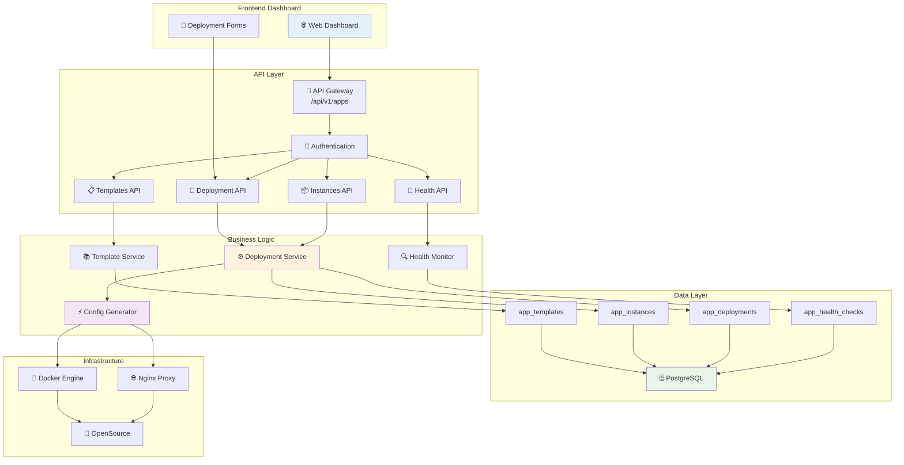

```mermaid
graph TB
    subgraph "Frontend Dashboard"
        UI["🌐 Web Dashboard"]
        FORMS["📝 Deployment Forms"]
    end
    
    subgraph "API Layer"
        GATEWAY["🚪 API Gateway<br/>/api/v1/apps"]
        AUTH["🔐 Authentication"]
        TEMPLATES["📋 Templates API"]
        DEPLOY["🚀 Deployment API"]
        INSTANCES["📦 Instances API"]
        HEALTH["💓 Health API"]
    end
    
    subgraph "Business Logic"
        TEMPLATE_SVC["📚 Template Service"]
        DEPLOY_SVC["⚙️ Deployment Service"]
        HEALTH_SVC["🔍 Health Monitor"]
        CONFIG_GEN["⚡ Config Generator"]
    end
    
    subgraph "Data Layer"
        DB["🗄️ PostgreSQL"]
        TEMPLATES_TBL["app_templates"]
        INSTANCES_TBL["app_instances"]
        DEPLOY_TBL["app_deployments"]
        HEALTH_TBL["app_health_checks"]
    end
    
    subgraph "Infrastructure"
        DOCKER["🐳 Docker Engine"]
        NGINX["🌐 Nginx Proxy"]
        OMNI["📁 OpenSource"]
    end
    
    UI --> GATEWAY
    FORMS --> DEPLOY
    
    GATEWAY --> AUTH
    AUTH --> TEMPLATES
    AUTH --> DEPLOY
    AUTH --> INSTANCES
    AUTH --> HEALTH
    
    TEMPLATES --> TEMPLATE_SVC
    DEPLOY --> DEPLOY_SVC
    INSTANCES --> DEPLOY_SVC
    HEALTH --> HEALTH_SVC
    
    DEPLOY_SVC --> CONFIG_GEN
    CONFIG_GEN --> DOCKER
    CONFIG_GEN --> NGINX
    
    TEMPLATE_SVC --> TEMPLATES_TBL
    DEPLOY_SVC --> INSTANCES_TBL
    DEPLOY_SVC --> DEPLOY_TBL
    HEALTH_SVC --> HEALTH_TBL
    
    TEMPLATES_TBL --> DB
    INSTANCES_TBL --> DB
    DEPLOY_TBL --> DB
    HEALTH_TBL --> DB
    
    DOCKER --> OMNI
    NGINX --> OMNI
    
    style UI fill:#e3f2fd
    style DEPLOY_SVC fill:#fff3e0
    style CONFIG_GEN fill:#f3e5f5
    style DB fill:#e8f5e8
```